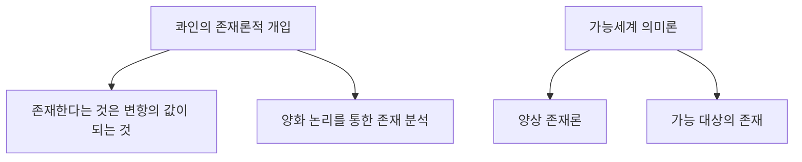

# 존재론의 역사

## 개요

존재론의 역사는 고대 그리스에서 시작하여 현대에 이르기까지 수천 년에 걸쳐 발전해왔습니다.

## 시대별 발전

### 고대 그리스

#### 파르메니데스 (Parmenides, 기원전 515-450)

!!! quote "파르메니데스"
    "있는 것은 있고, 없는 것은 없다."

파르메니데스는 서양 존재론의 아버지로 불립니다:

- **존재의 단일성**: 존재는 하나이며 불변
- **비존재의 불가능성**: 무(無)는 생각할 수 없음
- **변화의 환상성**: 감각적 변화는 환상

#### 플라톤 (Plato, 기원전 428-348)

플라톤의 **이데아론**:

```
감각 세계 (현상)
    ↑ 모방/참여
이데아 세계 (실재)
    - 선의 이데아
    - 아름다움의 이데아
    - 정의의 이데아
    - ...
```

#### 아리스토텔레스 (Aristotle, 기원전 384-322)

아리스토텔레스는 체계적인 존재론을 확립했습니다:

| 개념 | 그리스어 | 설명 |
|------|----------|------|
| 실체 | οὐσία (ousia) | 존재의 기본 단위 |
| 형상 | μορφή (morphe) | 사물의 본질적 특성 |
| 질료 | ὕλη (hyle) | 형상을 담는 기체 |
| 가능태 | δύναμις (dynamis) | 잠재적 상태 |
| 현실태 | ἐνέργεια (energeia) | 실현된 상태 |

### 중세 철학

#### 토마스 아퀴나스 (1225-1274)

아퀴나스는 아리스토텔레스 철학을 기독교 신학과 종합했습니다:

!!! info "존재와 본질의 구분"
    - **본질(essentia)**: 사물이 무엇인가
    - **존재(esse)**: 사물이 있다는 것
    - 신만이 본질과 존재가 동일

### 근대 철학

#### 데카르트 (1596-1650)

```
"나는 생각한다, 고로 나는 존재한다"
(Cogito, ergo sum)
```

데카르트의 이원론:
- **사유 실체(res cogitans)**: 정신
- **연장 실체(res extensa)**: 물질

#### 스피노자 (1632-1677)

**일원론적 존재론**:
- 오직 하나의 실체만 존재: 신 즉 자연 (Deus sive Natura)
- 모든 것은 이 하나의 실체의 양태(mode)

#### 라이프니츠 (1646-1716)

**단자론(Monadology)**:
- 실재는 무수한 단자(monad)로 구성
- 각 단자는 독립적이고 정신적 성격

### 현대 철학

#### 하이데거 (1889-1976)

!!! quote "하이데거"
    "존재란 무엇인가?"라는 물음이 망각되었다.

하이데거의 기여:
- **존재론적 차이**: 존재(Sein)와 존재자(Seiendes)의 구분
- **현존재(Dasein)**: 존재 물음을 묻는 특별한 존재자
- **시간성**: 존재의 의미는 시간과 연결

#### 분석철학의 존재론

현대 분석철학에서의 존재론:



## 존재론의 현대적 전환

| 시대 | 주요 관심사 | 대표 철학자 |
|------|-------------|-------------|
| 고대 | 존재의 본질 | 파르메니데스, 아리스토텔레스 |
| 중세 | 신과 존재 | 아퀴나스 |
| 근대 | 실체와 인식 | 데카르트, 스피노자 |
| 현대 | 언어와 존재 | 하이데거, 콰인 |

## 다음 단계

존재론의 핵심 개념을 더 깊이 알아보려면 [존재와 실존](../concepts/being-and-existence.md)으로 이동하세요.
